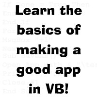



## Newbie's Tutorial

### Description

This tutorial (in Microsoft Office .doc format) teaches some basic things about making a good app in Visual Basic, and about several basic functions, plus some stuff on data types. You'll learn lots of things to help you become a better programmer.
 
### More Info
 

             |
---                |---
**Submitted On**   |2001-07-22 11:16:08
**By**             |[Jamie Lindgren](https://github.com/Planet-Source-Code/PSCIndex/blob/master/ByAuthor/jamie-lindgren.md)
**Level**          |Beginner
**User Rating**    |4.0 (8 globes from 2 users)
**Compatibility**  |VB 6\.0
**Category**       |[Miscellaneous](https://github.com/Planet-Source-Code/PSCIndex/blob/master/ByCategory/miscellaneous__1-1.md)
**World**          |[Visual Basic](https://github.com/Planet-Source-Code/PSCIndex/blob/master/ByWorld/visual-basic.md)
**Archive File**   |[Newbie's T235857262001\.zip](https://github.com/Planet-Source-Code/jamie-lindgren-newbie-s-tutorial__1-25544/archive/master.zip)

